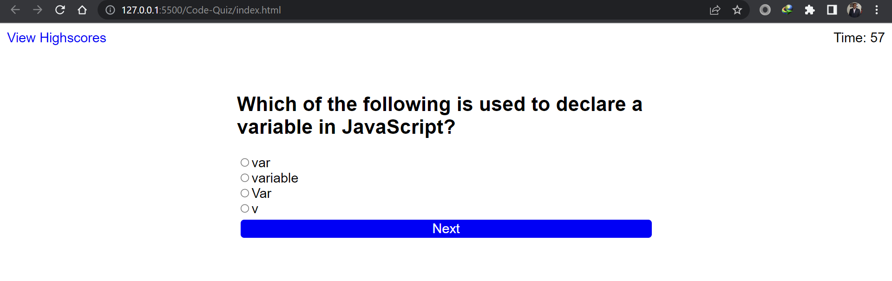
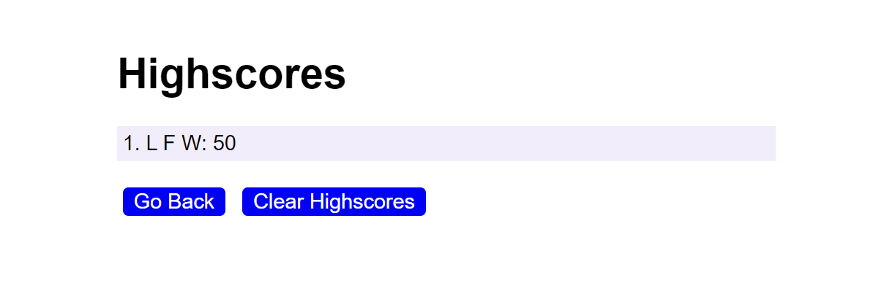

# Code-Quiz

A multiple choice quiz with the subject of front end web development languages (HTML, CSS, JavaScript)

## Table of Contents

* [Description](#description)

* [Installation](#installation)

* [Usage](#usage)

* [Screenshots](#screenshots)

* [Links](#links)

* [Credits](#credits)

* [License](#license)

## Description

This is a multiple choice quiz with the subject of front end web development languages (HTML, CSS, JavaScript). The quiz is timed and the user is given 60 seconds to complete the quiz. If the user answers a question incorrectly, 10 seconds is deducted from the timer and 5 is added for correct answers. The user can save their score and initials to the high scores page. The user can also clear the high scores page.

## Installation

To install this project, clone the repository to your local machine.

## Usage

To use this project, open the index.html file in your browser.

## Screenshots

## Links

* [Repository](https://github.com/Room4Renzo/Code-Quiz/tree/main)
* [Deployed Application](https://room4renzo.github.io/Code-Quiz/)

## Credits

Made by: Room4Renzo

## License

MIT License
